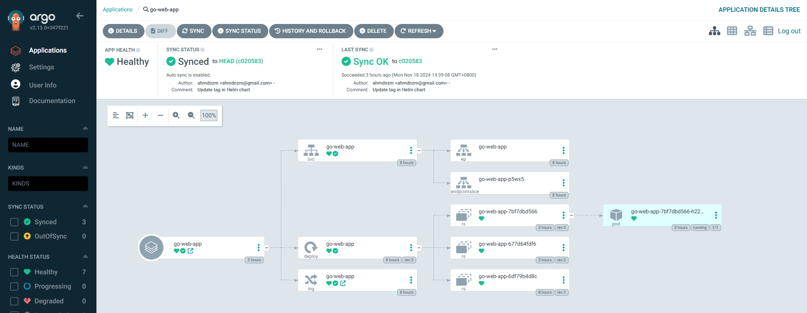

This is a continuation of work from the [go-web-app](https://github.com/ahmdnzm/go-web-app) repository.

# Create CI/CD pipeline

## Setup EKS Cluster

- Create directory called `kubernetes/manifests`

```bash
mkdir -p kubernetes/manifests
```

- Create `deployment.yaml`
- Create `service.yaml`
- Create `ingress.yaml`

For Kubectl & eksctl installation can refer this guide.

https://docs.aws.amazon.com/eks/latest/userguide/install-kubectl.html

- Deploy EKS Cluster

```yaml
eksctl create cluster --name go-cluster --region us-east-1
```

- Whenever finish doing this project, always remember to delete EKS Cluster

```yaml
eksctl delete cluster --name go-cluster --region us-east-1
```

- Define kubectl alias as k

```yaml
echo 'alias k=kubectl' >> ~/.bashrc
source ~/.bashrc
k get ns
```

- Deploy `deployment.yaml` manifest

```yaml
k apply -f kubernetes/manifests/deployment.yaml
```

- Verify pod is created

```yaml
k get pod
```

- Output

```yaml
NAME                          READY   STATUS    RESTARTS   AGE
go-web-app-6df79b4d8c-7tf6f   1/1     Running   0          34s
```

- Deploy `service.yaml`

```yaml
k apply -f kubernetes/manifests/service.yaml
```

- Deploy `ingress.yaml`

```yaml
k apply -f kubernetes/manifests/ingress.yaml
```

Create Ingress-Nginx Controller

- Reference https://kubernetes.github.io/ingress-nginx/deploy/#aws

```yaml
kubectl apply -f https://raw.githubusercontent.com/kubernetes/ingress-nginx/controller-v1.11.1/deploy/static/provider/aws/deploy.yaml
```

Verify the ingress-nginx pod is running

```yaml
k get all -n ingress-nginx
```

- Get the `ingress` resources. Check the ADDRESS section for LoadBalancer URL

```yaml
k get ing
```

- Output

```bash
NAME         CLASS   HOSTS              ADDRESS                                                                         PORTS   AGE
go-web-app   nginx   go-web-app.local   a0f86af4f5fff40368c7418887d18dc6-c4c0f7791fdca7d1.elb.us-east-1.amazonaws.com   80      6h13m
```

- Do `nslookup` to find LoadBalancer ip address

```yaml
nslookup <LoadBalancer address>
```

- Add LoadBalancer IP address and `go-web-app.local` in the `/etc/hosts`

```bash
127.0.0.1       localhost
98.82.71.136    go-web-app.local
```

Access the Go Web App with the following URL
```
http://go-web-app.local/courses
```

## Helm Chart Configuration

- The concept of Helm is to deploy different environments, such as development (dev), quality assurance (QA), and production (prod), by passing specific variables for each environment.

- Install Helm

```yaml
curl https://baltocdn.com/helm/signing.asc | gpg --dearmor | sudo tee /usr/share/keyrings/helm.gpg > /dev/null
sudo apt-get install apt-transport-https --yes
echo "deb [arch=$(dpkg --print-architecture) signed-by=/usr/share/keyrings/helm.gpg] https://baltocdn.com/helm/stable/debian/ all main" | sudo tee /etc/apt/sources.list.d/helm-stable-debian.list
sudo apt-get update
sudo apt-get install helm
```

- Create helm chart

```yaml
mkdir helm
cd helm
helm create go-web-app-chart
```

- Remove charts directory

```yaml
cd go-web-app-chart
rm -fr charts
```

- `Chart.yaml` give information of the chart
- Remove everything in `templates` directory

```yaml
cd templates
rm -fr *
```

- Copy kubernetes manifests to `templates` directory

```yaml
cp ../../../kubernetes/manifests/* .
```

- Edit `deployment.yaml` and replace `v1` with `{{ .Values.image.tag }}`

```yaml
image: ahmdnzm/go-web-app:{{ .Values.image.tag }}
```

- Edit `values.yaml` and replace the content with this
    
    ```yaml
    # Default values for go-web-app-chart.
    # This is a YAML-formatted file.
    # Declare variables to be passed into your templates.
    
    replicaCount: 1
    
    image:
      repository: ahmdnzm/go-web-app
      pullPolicy: IfNotPresent
      # Overrides the image tag whose default is the chart appVersion.
      tag: "v1"
    
    ingress:
      enabled: false
      className: ""
      annotations: {}
        # kubernetes.io/ingress.class: nginx
        # kubernetes.io/tls-acme: "true"
      hosts:
        - host: chart-example.local
          paths:
            - path: /
              pathType: ImplementationSpecific
    
    ```
    
- Check kubernetes resources

```yaml
k get all
```

- Delete deployment, service, and ingress

```yaml
k delete deploy go-web-app
k delete svc go-web-app
k delete ing go-web-app
```

- Check again all resources

```yaml
k get all
```

- Install helm chart. Run in `helm` directory

```yaml
helm install go-web-app ./go-web-app-chart
```

- Verify helm deployment is install correctly

```yaml
k get deploy
k get svc
k get ing
k get all
```


## CI using Github Action

List of activity for CI to implement multiple stages

- Build and test Unit Test
- Run static code analysis
- Create Docker image and push docker image to repository
- Update helm with the docker image created eg docker tag in `values.yaml` in `go-web-app-devops` repository

CD

- ArgoCD will watch the helm chart.
- Any changes in helm cart, it will pull and install in kubernetes cluster

Configure Github Action in `go-web-app` repository

- Create `.github/workflows` directory
- Create `cicd.yaml`

## Configure Github Action secret

- In the `go-web-app` repository, click on the **Settings** tab located in the top menu bar.
- In the left sidebar, click on **Secrets and variables** at **Security** section
- You will see two options: **Actions** and **Codespaces**. Click on **Actions**.
- Click the **New repository secret** button.
- Create secret for
    - DOCKERHUB_USERNAME
    - DOCKERHUB_TOKEN:
    - TOKEN 
<br>
<br>

## 💡 Create a Docker Hub Personal Access Token
- Log in with your Docker Hub credentials.
- Click on your profile picture in the top-right corner.
- Select **Account Settings** from the dropdown menu.
- Click on **Personal Access Tokens** section
- Access token description: `golang-cicd`
- Access permissions: `Read & Write`

## 💡 Create GitHub Personal Access Token
- In Github page, click on profile picture in the top-right corner
- Select **Settings > Developer Settings** scroll to bottom
- Click on **Personal access tokens > Tokens (classsic)
- ** Click **Generate new token > Generate new token (classic)
- ** Note : `golang-cicd`
- Scopes : `repo` and `write:packages`
- Click Generate Token
<br>
<br>
<br>

- Commit and push the changes

```yaml
git add .
git commit -m"feat: implemented ci"
git push
```

- Check in the GitHub repository > Actions to any problem on the workflows
- Once successful, check the image in Dockerhub

# **Install Argo CD**

## **Install Argo CD using manifests**

```bash
kubectl create namespace argocd
kubectl apply -n argocd -f https://raw.githubusercontent.com/argoproj/argo-cd/stable/manifests/install.yaml
```

- Change the `argocd-server` service type to `LoadBalancer`, which exposes the `argocd-server` service externally.

```bash
kubectl patch svc argocd-server -n argocd -p '{"spec": {"type": "LoadBalancer"}}'

```

## **Get the Loadbalancer service. Use `EXTERNAL-IP`**

```bash
kubectl get svc argocd-server -n argocd
```

Output

```bash
NAME            TYPE           CLUSTER-IP       EXTERNAL-IP                                                             PORT(S)                      AGE
argocd-server   LoadBalancer   10.100.147.199   ab229def3062443fea406747d334cc87-80514366.us-east-1.elb.amazonaws.com   80:31679/TCP,443:31334/TCP   2m42s
```

- Access the Argo CD based  on the external IP

```bash
http://ab229def3062443fea406747d334cc87-80514366.us-east-1.elb.amazonaws.com
```

- ArgoCD username : `admin`
- Get ArgoCD password

```yaml
k get secrets -n argocd
k edit secret argocd-initial-admin-secret -n argocd
```

- Decode the password

```yaml
echo <password> | base64 --decode
```

## Configure ArgoCD

- Login to ArgoCD
- Add Repository Credential
    - Navigate to `Settings/Repositories`
    - Choose your connection method: `VIA HTTPS`
    - Type: `git`
    - Project: `default`
    - Repository URL:
    - Username: `ahmdnzm`
    - Password : `<GitHub Password Access Token>`
- Create new App
    - Application Name: `go-web-app`
    - Project Name : `default`
    - Sync Policy : `Automatic`
    - Select `SELF HEAL`
    - Repository URL:
    
    ```yaml
    https://github.com/ahmdnzm/go-web-app-devops.git
    ```
    
    - Path: `helm/go-web-app-chart`
    - Cluster URL : `https://kubernetes.default.svc`
    - Namespace: `default`
    - Change to `Helm`
    - VALUES FILES: `values.yaml`
    - 
- Click Create
- Verify ArgoCD is able to sync successfully



Test the CI/CD pipeline by modifying files in the go-web-app/static directory.
Upon pushing changes to the repository, GitHub Actions and ArgoCD will automatically propagate the updates.